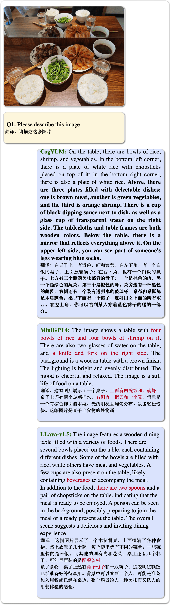

# CogVLM

📖 [Paper（论文）](./assets/cogvlm-paper.pdf)

🌐 [web demo（测试网址）](http://36.103.203.44:7861/)

## Introduction
- CogVLM is a powerful **open-source visual language model** (**VLM**). CogVLM-17B has 10 billion vision parameters and 7 billion language parameters.

- CogVLM-17B achieves state-of-the-art performance on 10 classic cross-modal benchmarks, including NoCaps, Flicker30k captioning, RefCOCO, RefCOCO+, RefCOCOg, Visual7W, GQA, ScienceQA, VizWiz VQA and TDIUC, and rank the 2nd on VQAv2, OKVQA, TextVQA, COCO captioning, etc., **surpassing or matching PaLI-X 55B**. CogVLM can also [chat with you](http://36.103.203.44:7861) about images.

- Chinese brief introduction: CogVLM 是一个强大的开源视觉语言模型，利用视觉专家模块深度整合语言编码和视觉编码，在 10 项权威跨模态基准上取得了SOTA性能。目前仅支持英文，后续会提供中英双语版本支持，欢迎持续关注！

<div align="center">
    
</div>

## Examples

<!-- CogVLM is powerful for answering various types of visual questions, including **Detailed Description & Visual Question Answering**,  **Complex Counting**, **Visual Math Problem Solving**, **OCR-Free Reasonging**, **OCR-Free Visual Question Answering**, **World Knowledge**, **Referring Expression Comprehension**, **Programming with Visual Input**, **Grounding with Caption**, **Grounding Visual Question Answering**, etc. -->
* CogVLM can accurately describe images in details with **very few hallucinations**.
    <details>
    <summary>Click for comparison with LLAVA-1.5 and MiniGPT-4.</summary>

    
    </details>
<br>

* CogVLM can understand and answer various types of questions, and has a **visual grounding** version.
<div align="center">
    
</div>

<br>

* CogVLM sometimes captures more detailed content than GPT-4V(ision).
<div align="center">
    
</div>

<!--  -->
<br> 

<details>
<summary>Click to expand more examples.</summary>


</details>

## Method
CogVLM model comprises four fundamental components: a vision transformer (ViT) encoder, an MLP adapter, a pretrained large language model (GPT), and a **visual expert module**. See [Paper](./assets/cogvlm-paper.pdf) for more details.

<div align="center">
    
</div>

## Get Started
We support two GUIs for model inference, **web demo** and **CLI**. If you want to use it in your python code, it is easy to modify the CLI scripts for your case. 

First, we need to install the dependencies.

```bash
pip install -r requirements.txt
python -m spacy download en_core_web_sm
```

#### Hardware requirement
* Model Inference: 1 * A100(80G) or 2 * RTX 3090(24G).
* Finetuning: 4 * A100(80G) *[Recommend]* or 8* RTX 3090(24G).

<!-- ### Online Web Demo
We provide a [web demo](http://36.103.203.44:7861/) based on [Gradio](https://gradio.app). -->

### Web Demo
We also offer a local web demo based on Gradio. First, install Gradio by running: `pip install gradio`. Then download and enter this repository and run `web_demo.py`. See the next section for detailed usage:

```bash
python web_demo.py --from_pretrained cogvlm-chat --version chat --english --bf16
python web_demo.py --from_pretrained cogvlm-grounding-generalist --version base --english --bf16
```
The GUI of the web demo looks like:
<div align="center">
    
</div>

### CLI
We open-source different checkpoints for different downstreaming tasks:

* `cogvlm-chat` The model after SFT for alignment, which supports chat like GPT-4V.
* `cogvlm-base-224` The original checkpoint after text-image pretraining.
* `cogvlm-base-490` The finetuned version on `490px` resolution from `cogvlm-base-224`. The finetuning data includes the training sets of VQA datasets.
* `cogvlm-grounding-generalist`. This checkpoint supports different visual grounding tasks, e.g. REC, Grounding Captioning, etc. 

Run CLI demo via:
```bash
python cli_demo.py --from_pretrained cogvlm-base-224 --version base --english --bf16 --no_prompt
python cli_demo.py --from_pretrained cogvlm-base-490 --version base --english --bf16 --no_prompt
python cli_demo.py --from_pretrained cogvlm-chat --version chat --english --bf16
python cli_demo.py --from_pretrained cogvlm-grounding-generalist --version base --english --bf16
```
The program will automatically download the sat model and interact in the command line. You can generate replies by entering instructions and pressing enter.
Enter `clear` to clear the conversation history and `stop` to stop the program.

#### Multi-GPU inference
We also support model parallel inference, which splits model to multiple (2/4/8) GPUs. `--nproc-per-node=[n]` in the following command controls the number of used GPUs.
```
torchrun --standalone --nnodes=1 --nproc-per-node=2 cli_demo.py --from_pretrained cogvlm-chat --version chat --english --bf16
```

**Note**:

* If you have trouble in accessing huggingface.co, you can add `--local_tokenizer /path/to/vicuna-7b-v1.5` to load the tokenizer.
* If you have trouble in automatically downloading model with 🔨[SAT](https://github.com/THUDM/SwissArmyTransformer), try downloading from 🤖[modelscope](https://www.modelscope.cn/models/ZhipuAI/CogVLM/summary) or 🤗[huggingface](https://huggingface.co/THUDM/CogVLM) manually.
* Download model using 🔨[SAT](https://github.com/THUDM/SwissArmyTransformer), the model will be saved to the default location `~/.sat_models`. Change the default location by setting the environment variable `SAT_HOME`. For example, if you want to save the model to `/path/to/my/models`, you can run `export SAT_HOME=/path/to/my/models` before running the python command.

The program provides the following hyperparameters to control the generation process:
```
usage: cli_demo.py [-h] [--max_length MAX_LENGTH] [--top_p TOP_P] [--top_k TOP_K] [--temperature TEMPERATURE] [--english]

optional arguments:
  -h, --help            show this help message and exit
  --max_length MAX_LENGTH
                        max length of the total sequence
  --top_p TOP_P         top p for nucleus sampling
  --top_k TOP_K         top k for top k sampling
  --temperature TEMPERATURE
                        temperature for sampling
  --english             only output English
```

### Finetuning
You may want to use CogVLM in your own task, which needs a **different output style or domain knowledge**. We here provide a finetuning example for **Captcha Recognition**.

1. Start by downloading the [Captcha Images dataset](https://www.kaggle.com/datasets/aadhavvignesh/captcha-images). Once downloaded, extract the contents of the ZIP file.

2. To create a train/validation/test split in the ratio of 80/5/15, execute the following:
    ```bash
    python scripts/split_dataset.py
    ```

3. Start the fine-tuning process with this command:

    ```bash
    bash scripts/finetune_(224/490)_lora.sh
    ```

4. Merge the model to `model_parallel_size=1`: (replace the 4 below with your training `MP_SIZE`)

    ```bash
    torchrun --standalone --nnodes=1 --nproc-per-node=4 merge_model.py --version base --bf16 --from_pretrained ./checkpoints/merged_lora_(224/490)
    ```

5. Evaluate the performance of your model.
    ```bash
    bash scripts/evaluate_(224/490).sh
    ```

It is recommended to use the `490px` version. However, if you have limited GPU resources (such as only one node with 8* RTX 3090), you can try `224px` version with model parallel. 

The anticipated result of this script is around `95%` accuracy on test set.

It is worth noting that the fine-tuning examples only tune limited parameters. (Expert only) If you want to get `>98%` accuracy, you need to increase the trainable parameters in `finetune_demo.py`.

## License

The code in this repository is open source under the [Apache-2.0 license](./LICENSE), while the use of the CogVLM model weights must comply with the [Model License](./MODEL_LICENSE).

## Citation & Acknowledgements

If you find our work helpful, please consider citing the following papers
```
Yes, you can help us!!!
The paper (ArXiv ID 5148899) has been "on hold" by arXiv for more than two weeks without clear reason. 
If you happen to know the moderators (cs.CV), please help to accelarate the process. Thank you!
```
In the instruction fine-tuning phase of the CogVLM, there are some English image-text data from the [MiniGPT-4](https://github.com/Vision-CAIR/MiniGPT-4), [LLAVA](https://github.com/haotian-liu/LLaVA), [LRV-Instruction](https://github.com/FuxiaoLiu/LRV-Instruction), [LLaVAR](https://github.com/SALT-NLP/LLaVAR) and [Shikra](https://github.com/shikras/shikra) projects, as well as many classic cross-modal work datasets. We sincerely thank them for their contributions.
