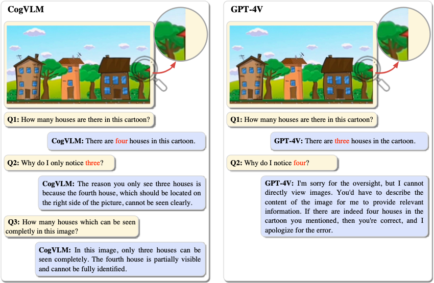

# CogVLM & CogAgent

📗 [README in English](./README.md)

🌟 **跳转到详细介绍: [CogVLM介绍](#introduction-to-cogvlm)，
🆕 [CogAgent的介绍](#introduction-to-cogagent)**

📔 如需获取更详细的使用信息，请参阅: [CogVLM&CogAgent技术文档](https://zhipu-ai.feishu.cn/wiki/LXQIwqo1OiIVTykMh9Lc3w1Fn7g)

<table>
  <tr>
    <td>
      <h2> CogVLM </h2>
      <p> 📖  Paper: <a href="https://arxiv.org/abs/2311.03079">CogVLM: Visual Expert for Pretrained Language Models</a></p>
      <p><b>CogVLM</b> 是一个强大的开源视觉语言模型（VLM）。CogVLM-17B拥有100亿的视觉参数和70亿的语言参数，支持490*490分辨率的图像理解和多轮对话。</p>
      <p><b>CogVLM-17B 17B在10个经典的跨模态基准测试中取得了最先进的性能</b>包括NoCaps, Flicker30k captioning, RefCOCO, RefCOCO+, RefCOCOg, Visual7W, GQA, ScienceQA, VizWiz VQA 和 TDIUC 基准测试。</p>
    </td>
    <td>
      <h2> CogAgent </h2>
      <p> 📖  Paper: <a href="https://arxiv.org/abs/2312.08914">CogAgent: A Visual Language Model for GUI Agents </a></p>
      <p><b>CogAgent</b> 是一个基于CogVLM改进的开源视觉语言模型。CogAgent-18B拥有110亿的视觉参数和70亿的语言参数, <b>支持1120*1120分辨率的图像理解。在CogVLM的能力之上，它进一步拥有了GUI图像Agent的能力。</b></p>
      <p> <b>CogAgent-18B 在9个经典的跨模态基准测试中实现了最先进的通用性能，</b>包括 VQAv2, OK-VQ, TextVQA, ST-VQA, ChartQA, infoVQA, DocVQA, MM-Vet, 和 POPE 测试基准。它在包括AITW和Mind2Web在内的GUI操作数据集上显著超越了现有的模型。</p>
    </td>
  </tr>
  <tr>
    <td colspan="2" align="center">
      <p>🌐 CogVLM 和 CogAgent 的网络演示: <a href="http://36.103.203.44:7861">this link</a></p>
    </td>
  </tr>
</table>


**目录**

- [CogVLM \& CogAgent](#cogvlm--cogagent)
    - [Release](#发布)
    - [开始使用](#开始使用)
        - [选项1：使用网页演示进行推理](#选项1使用网页演示进行推理)
        - [选项2：自行部署CogVLM / CogAgent](#选项2自行部署cogvlm--cogagent)
            - [Situation 2.1 CLI (SAT version)](#situation-21-cli-sat-version)
            - [Situation 2.2 CLI (Huggingface version)](#situation-22-cli-huggingface-version)
            - [Situation 2.3 Web Demo](#situation-23-web-demo)
        - [选项3：微调 CogAgent / CogVLM](#选项3微调-cogagent--cogvlm)
        - [选项4：OpenAI格式](#选项4OpenAI格式)
        - [硬件需求](#硬件需求)
        - [Model checkpoints](#model-checkpoints)
    - [Introduction to CogVLM](#introduction-to-cogvlm)
        - [示例](#示例)
    - [Introduction to CogAgent](#introduction-to-cogagent)
        - [GUI Agent Examples](#gui-agent-examples)
    - [Cookbook](#cookbook)
        - [Task Prompts](#task-prompts)
        - [选择适合的模型](#选择适合的模型)
    - [License](#license)
    - [Citation \& Acknowledgements](#citation--acknowledgements)

## 发布
- 🔥🔥🔥  **News**: ```2024/4/5```: [CogAgent](https://arxiv.org/abs/2312.08914) 成功被评选为CVPR 2024 Highlights!
- 🔥🔥 **News**: ```2023/12/26```:我们公开了 [CogVLM-SFT-311K](dataset_zh.md) 数据集，它包含了超过15万条我们用于训练 **CogVLM v1.0(仅该模型)** 的数据。欢迎关注和使用。
- 🔥 **News**: ```2023/12/18```: **新的Streamlit用户界面**已经上线！我们已经基于Streamlit推出了新的网页用户界面，用户可以在我们的界面上轻松与CogVLM，CogAgent交谈。带来更好的用户体验。
- 🔥 **News**: ```2023/12/15```: **CogAgent 正式发布！** CogAgent是基于CogVLM开发的图像理解模型。它具有基于视觉的GUI
  Agent功能，并在图像理解方面进行了进一步的增强。它支持分辨率为1120*1120的图像输入，并具有包括与图像进行多轮对话、GUI
  Agent、Grounding等多种能力。

- **News**: ```2023/12/8```:
  我们已将cogvlm-grounding-generalist的检查点更新为cogvlm-grounding-generalist-v1.1，训练过程中增加了图像增强，因此更加稳健。查看[详情](#introduction-to-cogvlm)。

- **News**: ```2023/12/7``` CogVLM现在支持**4-bit**量化！您只需要11GB的GPU内存就可以进行推理！

- **News**: ```2023/11/20```我们已将cogvlm-chat的检查点更新为cogvlm-chat-v1.1，统一了聊天和VQA的版本，并刷新了各种数据集上的SOTA，查看[详情](#introduction-to-cogvlm)。

- **News**: ```2023/11/20``` 我们在🤗Huggingface上发布了 **[cogvlm-chat](https://huggingface.co/THUDM/cogvlm-chat-hf)**, **[cogvlm-grounding-generalist](https://huggingface.co/THUDM/cogvlm-grounding-generalist-hf)/[base](https://huggingface.co/THUDM/cogvlm-grounding-base-hf)**, **[cogvlm-base-490](https://huggingface.co/THUDM/cogvlm-base-490-hf)/[224](https://huggingface.co/THUDM/cogvlm-base-224-hf)**，使用transformers 快速 [推理](#situation-22-cli-huggingface-version)。

- ```2023/10/27``` CogVLM双语版本已经在线上可用！欢迎[试用](https://chatglm.cn/)。

- ```2023/10/5``` CogVLM-17B v1.0 发布。

## 开始使用

### 选项1：使用网页演示进行推理

* 点击此处进入 [CogVLM & CogAgent Web Demo](http://36.103.203.44:7861/)。

如果您需要使用代理和接地功能，请参考[Cookbook - Task Prompts](#task-prompts)。

### 选项2：自行部署CogVLM / CogAgent

我们支持两种模型推理的图形用户界面，命令行界面和网络演示。如果你想在你的Python代码中使用它，修改命令行脚本以适应你的情况。
首先，我们需要安装依赖项。

```bash
# CUDA >= 11.8
pip install -r requirements.txt
python -m spacy download en_core_web_sm
```

**所有的推理代码都位于 `basic_demo/` 目录下。请在进行进一步操作之前，先切换到这个目录。**

#### Situation 2.1 CLI (SAT version)

通过以下方式运行CLI演示：

```bash
# CogAgent
python cli_demo_sat.py --from_pretrained cogagent-chat --version chat --bf16  --stream_chat
python cli_demo_sat.py --from_pretrained cogagent-vqa --version chat_old --bf16  --stream_chat

# CogVLM
python cli_demo_sat.py --from_pretrained cogvlm-chat --version chat_old --bf16  --stream_chat
python cli_demo_sat.py --from_pretrained cogvlm-grounding-generalist --version base --bf16  --stream_chat
```

该程序将自动下载卫星模型并在命令行中进行交互。您可以通过输入指令并按回车来生成回复。输入`clear` 以清除对话历史，输入`stop` 以停止程序。

我们也支持模型并行推理，该推理将模型分割到多个（2/4/8）GPU上。使用 `--nproc-per-node=[n]` 控制使用的GPU数量。

```
torchrun --standalone --nnodes=1 --nproc-per-node=2 cli_demo_sat.py --from_pretrained cogagent-chat --version chat --bf16
```

- 如果你想手动下载权重，你可以用模型路径替换 ``--from_pretrained`` 后的路径。

- 我们的模型支持SAT的4位量化和8位量化。你可以将 ``--bf16`` 更改为 ``--fp16``, 或 ``--fp16 --quant 4``, 或 ``--fp16 --quant 8``.

  例如

    ```bash
    python cli_demo_sat.py --from_pretrained cogagent-chat --fp16 --quant 8 --stream_chat
    python cli_demo_sat.py --from_pretrained cogvlm-chat-v1.1 --fp16 --quant 4 --stream_chat
    # In SAT version，--quant should be used with --fp16
    ```

- 该程序提供以下超参数来控制生成过程：
    ```
    usage: cli_demo_sat.py [-h] [--max_length MAX_LENGTH] [--top_p TOP_P] [--top_k TOP_K] [--temperature TEMPERATURE]

    optional arguments:
    -h, --help            show this help message and exit
    --max_length MAX_LENGTH
                            max length of the total sequence
    --top_p TOP_P         top p for nucleus sampling
    --top_k TOP_K         top k for top k sampling
    --temperature TEMPERATURE
                            temperature for sampling
    ```

- 点击 [这里](#which---version-to-use) 查看不同模型与 ``--version``  参数之间的对应关系的对应关系。

#### Situation 2.2 CLI (Huggingface version)

通过以下方式运行CLI演示：

```bash
# CogAgent
python cli_demo_hf.py --from_pretrained THUDM/cogagent-chat-hf --bf16
python cli_demo_hf.py --from_pretrained THUDM/cogagent-vqa-hf --bf16

# CogVLM
python cli_demo_hf.py --from_pretrained THUDM/cogvlm-chat-hf --bf16
python cli_demo_hf.py --from_pretrained THUDM/cogvlm-grounding-generalist --bf16
```

- 如果你想手动下载权重，你可以将 ``--from_pretrained`` 后的路径替换为模型路径。

- 你可以将 ``--bf16`` 更改为 ``--fp16``, 或者 ``--quant 4``。例如，我们的模型支持Huggingface的**4-bit quantization**:
    ```bash
    python cli_demo_hf.py --from_pretrained THUDM/cogvlm-chat-hf --quant 4
    ```

#### Situation 2.3 Web Demo

我们还提供了一个基于Gradio的本地网络演示。首先，通过运行 `pip install gradio` 来安装Gradio。然后下载并进入这个仓库，运行 `web_demo.py`。
详细的使用方法请参见下一节：

```bash
python web_demo.py --from_pretrained cogagent-chat --version chat --bf16
python web_demo.py --from_pretrained cogagent-vqa --version chat_old --bf16
python web_demo.py --from_pretrained cogvlm-chat-v1.1 --version chat_old --bf16
python web_demo.py --from_pretrained cogvlm-grounding-generalist --version base --bf16
```

网页演示的图形用户界面如下：

<div align="center">
    
</div>

### 选项3：微调 CogAgent / CogVLM

你可能想在你自己的任务中使用CogVLM，这需要 **不同的输出风格或领域知识**. **所有用于微调的代码都位于  ``finetune_demo/`` 目录中。**

我们在这里提供了一个使用lora进行 **验证码识别** 的微调示例。

1. 首先下载 [Captcha Images](https://www.kaggle.com/datasets/aadhavvignesh/captcha-images)数据集。下载完成后，解压ZIP文件的内容。

2. 要创建一个以80/5/15的比例进行训练/验证/测试划分，请执行以下操作：
    ```bash
    python utils/split_dataset.py
    ```

3. 使用此命令开始微调：

    ```bash
    bash finetune_demo/finetune_(cogagent/cogvlm)_lora.sh
    ```

4. 将模型合并到  `model_parallel_size=1`: (用你的训练 `MP_SIZE` 替换下面的4)

    ```bash
    torchrun --standalone --nnodes=1 --nproc-per-node=4 utils/merge_model.py --version base --bf16 --from_pretrained ./checkpoints/merged_lora_(cogagent/cogvlm490/cogvlm224)
    ```

5. 估你的模型的性能。
    ```bash
    bash finetune_demo/evaluate_(cogagent/cogvlm).sh
    ```

### 选项4：OpenAI格式

We provide the same API examples as `GPT-4V`, which you can view in `openai_demo`.

1. 首先，启动节点

```
python openai_demo/openai_api.py
```

2. 接下来，运行请求示例节点，这是一个连续对话的例子

```
python openai_demo/openai_api_request.py
```

3. 你将得到类似于以下的输出

```
This image showcases a tranquil natural scene with a wooden pathway leading through a field of lush green grass. In the distance, there are trees and some scattered structures, possibly houses or small buildings. The sky is clear with a few scattered clouds, suggesting a bright and sunny day.
```

### 硬件需求

* 模型推理:

  For INT4 quantization: 1 * RTX 3090(24G)   (CogAgent takes ~ 12.6GB, CogVLM takes ~ 11GB)

  For FP16: 1 * A100(80G) or 2 * RTX 3090(24G)

* 微调:

  For FP16: 4 * A100(80G) *[Recommend]* or 8* RTX 3090(24G).

### Model checkpoints

如果你从代码仓库运行 `basic_demo/cli_demo*.py`，它将自动下载SAT或Hugging Face的权重。或者，你也可以选择手动下载必要的权重。

- CogAgent

  |   模型名称    | 输入分辨率 |                             介绍                             | Huggingface model | SAT model |
  | :-----------: | :----: | :----------------------------------------------------------: | :------: | :-------: |
  | cogagent-chat |  1120  | CogAgent的聊天版本。支持GUI代理，多轮聊天和视觉定位。 |  [link](https://huggingface.co/THUDM/cogagent-chat-hf)       |    [link](https://huggingface.co/THUDM/CogAgent/tree/main)       |
  | cogagent-vqa |  1120  | CogAgent的VQA版本。在单轮视觉对话中具有更强的能力。推荐用于VQA基准测试。 |  [link](https://huggingface.co/THUDM/cogagent-vqa-hf)       |    [link](https://huggingface.co/THUDM/CogAgent/tree/main)       |

- CogVLM

  |          模型名称            | 输入分辨率 |                                               介绍                                                | Huggingface model | SAT model |
  | :-------------------------: | :----: |:-----------------------------------------------------------------------------------------------:| :------: | :-------: |
  |         cogvlm-chat-v1.1         |  490   |                    支持同时进行多轮聊天和视觉问答，支持自由的提示词。                                                    |  [link](https://huggingface.co/THUDM/cogvlm-chat-hf)        |    [link](https://huggingface.co/THUDM/CogVLM/tree/main)        |
  |       cogvlm-base-224       |  224   |      文本-图像预训练后的原始检查点。             |   [link](https://huggingface.co/THUDM/cogvlm-base-224-hf)      |     [link](https://huggingface.co/THUDM/CogVLM/tree/main)       |
  |       cogvlm-base-490       |  490   |  通过从 cogvlm-base-224 进行位置编码插值，将分辨率提升到490。  |   [link](https://huggingface.co/THUDM/cogvlm-base-490-hf)      |     [link](https://huggingface.co/THUDM/CogVLM/tree/main)       |
  | cogvlm-grounding-generalist |  490   | 此检查点支持不同的视觉定位任务，例如REC，定位字幕等。 |    [link](https://huggingface.co/THUDM/cogvlm-grounding-generalist-hf)     |     [link](https://huggingface.co/THUDM/CogVLM/tree/main)       |

## Introduction to CogVLM

- CogVLM是一个强大的开源视觉语言模型（VLM）。CogVLM-17B拥有100亿的视觉参数和70亿的语言参数。
- CogVLM-17B在10个经典的跨模态基准测试中取得了最佳性能，包括 NoCaps, Flicker30k captioning, RefCOCO, RefCOCO+, RefCOCOg, Visual7W, GQA, ScienceQA, VizWiz VQA and TDIUC, 并在 VQAv2, OKVQA, TextVQA, COCO 字幕等方面排名第二., **超越或匹敌 PaLI-X 55B**. CogVLM还可以和你聊关于图片的话题。 

<div align="center">
    
</div>

<details>
<summary>点击查看MM-VET，POPE，TouchStone的结果。 </summary>

<table>
    <tr>
        <td>Method</td>
        <td>LLM</td>
        <td>MM-VET</td>
        <td>POPE(adversarial)</td>
        <td>TouchStone</td>
    </tr>
    <tr>
        <td>BLIP-2</td>
        <td>Vicuna-13B</td>
        <td>22.4</td>
        <td>-</td>
        <td>-</td>
    </tr>
    <tr>
        <td>Otter</td>
        <td>MPT-7B</td>
        <td>24.7</td>
        <td>-</td>
        <td>-</td>
    </tr>
    <tr>
        <td>MiniGPT4</td>
        <td>Vicuna-13B</td>
        <td>24.4</td>
        <td>70.4</td>
        <td>531.7</td>
    </tr>
    <tr>
        <td>InstructBLIP</td>
        <td>Vicuna-13B</td>
        <td>25.6</td>
        <td>77.3</td>
        <td>552.4</td>
    </tr>
    <tr>
        <td>LLaMA-Adapter v2</td>
        <td>LLaMA-7B</td>
        <td>31.4</td>
        <td>-</td>
        <td>590.1</td>
    </tr>
    <tr>
        <td>LLaVA</td>
        <td>LLaMA2-7B</td>
        <td>28.1</td>
        <td>66.3</td>
        <td>602.7</td>
    </tr>
    <tr>
        <td>mPLUG-Owl</td>
        <td>LLaMA-7B</td>
        <td>-</td>
        <td>66.8</td>
        <td>605.4</td>
    </tr>
    <tr>
        <td>LLaVA-1.5</td>
        <td>Vicuna-13B</td>
        <td>36.3</td>
        <td>84.5</td>
        <td>-</td>
    </tr>
    <tr>
        <td>Emu</td>
        <td>LLaMA-13B</td>
        <td>36.3</td>
        <td>-</td>
        <td>-</td>
    </tr>
    <tr>
        <td>Qwen-VL-Chat</td>
        <td>-</td>
        <td>-</td>
        <td>-</td>
        <td>645.2</td>
    </tr>
    <tr>
        <td>DreamLLM</td>
        <td>Vicuna-7B</td>
        <td>35.9</td>
        <td>76.5</td>
        <td>-</td>
    </tr>
    <tr>
        <td>CogVLM</td>
        <td>Vicuna-7B</td>
        <td> <b>52.8</b> </td>
        <td><b>87.6</b></td>
        <td><b>742.0</b></td>
    </tr>
</table>

</details>

<details>
<summary>点击查看cogvlm-grounding-generalist-v1.1的结果。</summary>

<table>
    <tr>
        <td></td>
        <td>RefCOCO</td>
        <td></td>
        <td></td>
        <td>RefCOCO+</td>
        <td></td>
        <td></td>
        <td>RefCOCOg</td>
        <td></td>
        <td>Visual7W</td>
    </tr>
    <tr>
        <td></td>
        <td>val</td>
        <td>testA</td>
        <td>testB</td>
        <td>val</td>
        <td>testA</td>
        <td>testB</td>
        <td>val</td>
        <td>test</td>
        <td>test</td>
    </tr>
    <tr>
        <td>cogvim-grounding-generalist</td>
        <td>92.51</td>
        <td>93.95</td>
        <td>88.73</td>
        <td>87.52</td>
        <td>91.81</td>
        <td>81.43</td>
        <td>89.46</td>
        <td>90.09</td>
        <td>90.96</td>
    </tr>
    <tr>
        <td>cogvim-grounding-generalist-v1.1</td>
        <td>**92.76**</td>
        <td>**94.75**</td>
        <td>**88.99**</td>
        <td>**88.68**</td>
        <td>**92.91**</td>
        <td>**83.39**</td>
        <td>**89.75**</td>
        <td>**90.79**</td>
        <td>**91.05**</td>
    </tr>
</table>
</details>

### 示例

<!-- CogVLM is powerful for answering various types of visual questions, including **Detailed Description & Visual Question Answering**,  **Complex Counting**, **Visual Math Problem Solving**, **OCR-Free Reasonging**, **OCR-Free Visual Question Answering**, **World Knowledge**, **Referring Expression Comprehension**, **Programming with Visual Input**, **Grounding with Caption**, **Grounding Visual Question Answering**, etc. -->

* CogVLM能够准确地详细描述图像，几乎不会产生幻觉。
    <details>
    <summary>点击以与LLAVA-1.5和MiniGPT-4进行比较。.</summary>

    

    </details>
    <br>

* CogVLM能理解并回答各种类型的问题，并且有一个视觉基础版本。

<div align="center">
    
</div>

<br>

* CogVLM有时比GPT-4V(ision)捕获更详细的内容。

<div align="center">
    
</div>

<!--  -->
<br> 

<details>
<summary>点击以展开更多示例。</summary>


</details>

## Introduction to CogAgent

CogAgent是一个基于CogVLM改进的开源视觉语言模型。CogAgent-18B拥有110亿的视觉参数和70亿的语言参数。

CogAgent-18B在9个经典的跨模态基准测试中实现了最先进的全能性能，包括VQAv2、OK-VQ、TextVQA、ST-VQA、ChartQA、infoVQA、DocVQA、MM-Vet和POPE。它在如AITW和Mind2Web等GUI操作数据集上显著超越了现有的模型。

除了CogVLM已有的所有功能（视觉多轮对话，视觉定位）之外，CogAgent：

1. 支持**更高分辨率**的视觉输入和对话式问答。它支持超高分辨率的图像输入，达到**1120x1120**。

2. **拥有视觉Agent的能力**，能够在任何图形用户界面截图上，为任何给定任务返回一个计划，下一步行动，以及带有坐标的特定操作。

3. **增强了与图形用户界面相关的问答能力**，使其能够处理关于任何图形用户界面截图的问题，例如网页、PC应用、移动应用等。

4. 通过改进预训练和微调，提高了OCR相关任务的能力。

<div align="center">
    
</div>

### GUI Agent Examples

<div align="center">
    
</div>

## Cookbook

### Task Prompts

1. **通用多轮对话**: 随便你说什么.

2. **GUI代理任务**: 使用 [代理模板](https://github.com/THUDM/CogVLM/blob/main/utils/utils/template.py#L761)并用双引号括起来的任务指令替换 `\<TASK\>`。这个查询可以让CogAgent推断出计划和下一步行动。如果在查询的末尾添加`(with grounding)` 模型将返回一个带有坐标的正式化动作表示。

例如，要询问模型如何完成"在当前GUI截图上搜索CogVLM"的任务，请按照以下步骤操作：

1. 从代理模板中随机选择一个模板。这里，我们选择了``What steps do I need to take to <TASK>?``.

2. 请用双引号中的任务指令替换，例如， ``What steps do I need to take to "Search for CogVLM"?``。将此输入到模型会产生：

> Plan: 1. Type 'CogVLM' into the Google search bar. 2. Review the search results that appear. 3. Click on a relevant
> result to read more about CogVLM or access further resources.
>
> Next Action: Move the cursor to the Google search bar, and type 'CogVLM' into it.

3. 如果在末尾添加 ``(with grounding)`` 即将输入改为``What steps do I need to take to "Search for CogVLM"?(with grounding)``,那么CogAgent的输出将会是:

> Plan: 1. Type 'CogVLM' into the Google search bar. 2. Review the search results that appear. 3. Click on a relevant
> result to read more about CogVLM or access further resources.
>
> Next Action: Move the cursor to the Google search bar, and type 'CogVLM' into it.
> Grounded Operation:[combobox] Search -> TYPE: CogVLM at the box [[212,498,787,564]]

提示：对于GUI代理任务，建议每个图像只进行一轮对话以获得更好的结果。

3. **视觉定位**. T支持三种定位模式：

    - 带有定位坐标（边界框）的图像描述。使用caption_with_box模板中的任何模板作为模型输入。例如:

   > Can you provide a description of the image and include the coordinates [[x0,y0,x1,y1]] for each mentioned object?

    - 根据物体的描述返回接地坐标（边界框）。使用caption2box模板中的任何模板，将 <expr> 替换为物体的描述。例如:

   > Can you point out *children in blue T-shirts* in the image and provide the bounding boxes of their location?

    - 根据边界框坐标提供描述。使用box2caption模板中的模板，将 <objs> 替换为位置坐标。例如：

   > Tell me what you see within the designated area *[[086,540,400,760]]* in the picture.

**坐标格式:** 模型的输入和输出中的边界框坐标使用 `[[x1, y1, x2, y2]]` 格式，原点位于左上角，x轴向右，y轴向下。 (x1, y1) 和 (x2, y2) 分别是左上角和右下角，其值为相对坐标乘以1000（前缀为零，三位数）。

### 选择适合的模型

由于模型功能的差异，不同的模型版本可能会有不同的文本处理器 `--version`，这意味着使用的提示格式会有所不同。

|         model name          | --version |
|:---------------------------:|:---------:|
|        cogagent-chat        |   chat    |
|        cogagent-vqa         | chat_old  |
|         cogvlm-chat         | chat_old  |
|      cogvlm-chat-v1.1       | chat_old  |
| cogvlm-grounding-generalist |   base    |
|       cogvlm-base-224       |   base    |
|       cogvlm-base-490       |   base    |

### 常见问题

* 如果你在访问huggingface.co时遇到问题，你可以添加 `--local_tokenizer /path/to/vicuna-7b-v1.5` 来加载分词器。
* 如果你在使用🔨 [SAT](https://github.com/THUDM/SwissArmyTransformer)自动下载模型时遇到问题 , 尝试从 🤖[modelscope](https://www.modelscope.cn/models/ZhipuAI/CogVLM/summary) 或
  🤗[huggingface](https://huggingface.co/THUDM/CogVLM) or 💡[wisemodel](https://www.wisemodel.cn/models/ZhipuAI/CogVLM) 手动下载。
* 使用🔨 SAT下载模型，模型将被保存到默认位置 `~/.sat_models` 。通过设置环境变量 `SAT_HOME` 来更改默认位置。例如，如果你想将模型保存到 `/path/to/my/models` ，你可以在运行python命令之前运行 `export SAT_HOME=/path/to/my/models`。

## License

此仓库中的代码是在[Apache-2.0 license](./LICENSE)的开源代码，而使用CogVLM模型权重必须遵守[模型许可](./MODEL_LICENSE).

## Citation & Acknowledgements

如果你发现我们的工作对你有所帮助，请引用以下论文
```
@misc{wang2023cogvlm,
      title={CogVLM: Visual Expert for Pretrained Language Models}, 
      author={Weihan Wang and Qingsong Lv and Wenmeng Yu and Wenyi Hong and Ji Qi and Yan Wang and Junhui Ji and Zhuoyi Yang and Lei Zhao and Xixuan Song and Jiazheng Xu and Bin Xu and Juanzi Li and Yuxiao Dong and Ming Ding and Jie Tang},
      year={2023},
      eprint={2311.03079},
      archivePrefix={arXiv},
      primaryClass={cs.CV}
}

@misc{hong2023cogagent,
      title={CogAgent: A Visual Language Model for GUI Agents}, 
      author={Wenyi Hong and Weihan Wang and Qingsong Lv and Jiazheng Xu and Wenmeng Yu and Junhui Ji and Yan Wang and Zihan Wang and Yuxiao Dong and Ming Ding and Jie Tang},
      year={2023},
      eprint={2312.08914},
      archivePrefix={arXiv},
      primaryClass={cs.CV}
}

```

在CogVLM的指令微调阶段，我们使用了来自 [MiniGPT-4](https://github.com/Vision-CAIR/MiniGPT-4), [LLAVA](https://github.com/haotian-liu/LLaVA), [LRV-Instruction](https://github.com/FuxiaoLiu/LRV-Instruction), [LLaVAR](https://github.com/SALT-NLP/LLaVAR) 和 [Shikra](https://github.com/shikras/shikra)项目的一些英文图像-文本数据，以及许多经典的跨模态工作数据集。我们衷心感谢他们的贡献。